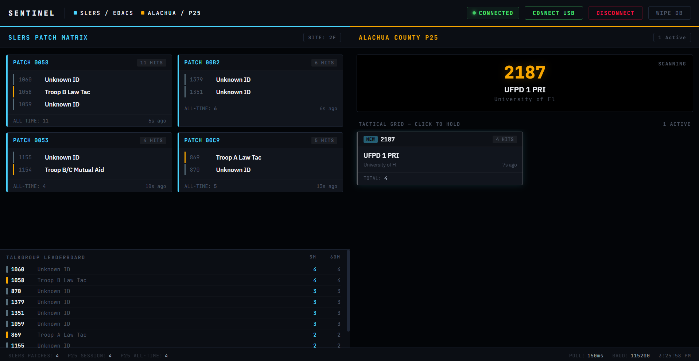

<div align="center">
  
  <h1>BearSentinel</h1>
  <p><strong>Heuristics & Telemetry Dashboard for Uniden Scanners via Web Serial API</strong></p>
  <p>
    
    
    
    
  </p>
</div>

---

BearSentinel is a browser-based telemetry dashboard that decodes, visualizes, and persists radio network metadata intercepted live from a Uniden BCD325P2 scanner over USB serial. It operates entirely offline using the [Web Serial API](https://developer.mozilla.org/en-US/docs/Web/API/Web_Serial_API) — no server, no install, no cloud.

## Table of Contents

- [Dashboards](#dashboards)
- [Telemetry Exploitation](#telemetry-exploitation)
- [Offline Persistence & Export](#offline-persistence--export)
- [Zero-Install Execution](#zero-install-execution)
- [Scanner Setup](#scanner-setup)
- [Development](#development)
- [Legal Notice](#legal-notice)

---

## Dashboards

BearSentinel provides two operational modes selectable at launch.

### EDACS Exclusive Mode (SLERS)

Dedicated to deep analysis of EDACS format control channels — specifically the State of Florida's Statewide Law Enforcement Radio System (SLERS). Intercepts raw `EDW`/`EDN` telemetry strings and surfaces:

- **Real-Time Patch Matrix** — Monitors spontaneous multi-agency operational patches as they form, with animated TX indicators for live keying activity. Patches prune automatically after 30 seconds of silence.
- **Live Grant Feed** — Decodes Control Channel Grants (`TG`, `ICALL`, `CPT`) to show exactly which talkgroup or unit is being allocated a voice channel. Reports the Logical Channel Number (LCN) or raw Voice Channel payload. Works even when voice traffic is encrypted.
- **Rolling Leaderboard** — Ranks talkgroups and patch IDs by activity spikes over trailing 5-minute and 60-minute windows. Useful for rapidly identifying major ongoing incidents by traffic volume.
- **Auto-LCN Map** — Passively harvests LCN-to-VC associations from voice grants as they arrive and builds a live site channel map without any pre-configuration.

### Unified Mode (EDACS + P25 Phase I/II)

Hybrid dashboard merging EDACS patch tracking with active P25 network polling, designed for local municipal system monitoring:

- **Visual Tactical Grid** — Issues `GLG` polls at 150ms intervals over the serial connection and maps scanner activity onto an interactive talkgroup card grid in real time.
- **Direct Scanner Override** — Click any talkgroup card to send `KEY,H,P` over serial, physically commanding the scanner's internal scan engine to hold on that channel. Deselect to release with `KEY,S,P`.
- **Talkgroup Discovery** — Automatically flags newly encountered talkgroups not present in the local agency database (`AgencyDB.ts`).

---

## Telemetry Exploitation

BearSentinel goes beyond call-following by extracting intelligence from the control channel infrastructure itself.

### Targeted Unit Tracking

EDACS `ICALL` and `CPT` grant messages carry a 14-bit Logical ID (LID) identifying the specific radio unit being patched to a voice channel. BearSentinel captures these LIDs alongside talkgroup assignments, meaning a specific field unit can be followed as it traverses from a Dispatch channel to a Tactical channel — even if both channels carry encrypted voice. The LID is the fingerprint; BearSentinel reads it regardless of audio encryption state.

### Auto-Discovered LCN Mapping

EDACS never transmits actual RF frequencies over the control channel. Instead, it allocates abstract Logical Channel Numbers (LCN 1–25) from a site-specific channel plan that is only stored in the scanner's codeplug. BearSentinel passively harvests `LCN → VC` pairings from voice grant messages as they occur and builds a site channel map on the fly — no pre-loaded frequency table required. The map is displayed in the **Auto-LCN Map** panel and exported with session data.

### Network Stress Diagnostics

BearSentinel intercepts `SYS-BUSY` and `QUEUEDid` control channel flags, which indicate that the EDACS site's repeater pool is saturated and incoming call requests are being queued or denied. During high-volume incidents this provides a real-time audit of infrastructure capacity constraints — visibility into exactly when and how the dispatch system is failing under load.

### ESK Bypass (EDACS Security Key)

M/A-COM marketed ESK as an access-control layer for EDACS control channels, intended to prevent civilian receivers from decoding control channel data. Modern Uniden firmware bypasses ESK natively at the hardware level. BearSentinel receives and processes the resulting plaintext telemetry stream with no additional handling — ESK is irrelevant to anything this dashboard does.

---

## Offline Persistence & Export

All session state is written to the local browser sandbox (`localStorage`) and is never transmitted anywhere.

| Store key | Contents |
|---|---|
| `sentinel_slers` | Persistent per-talkgroup hit counts for EDACS/SLERS activity |
| `sentinel_p25` | Persistent per-talkgroup hit counts for P25 activity |

Export options available at any time during a session:

- **CSV** — Flat log of all intercepted grant events: timestamp, talkgroup ID, agency name, grant type, LCN, and raw VC payload.
- **JSON** — Full structured state dump including session stats, patch history, leaderboard rankings, persistent hit counters, and the complete grant log.

The raw serial output drawer streams the last 200 intercepted scanner lines with syntax highlighting and can be toggled without interrupting the live feed.

---

## Zero-Install Execution

BearSentinel is built with Vite + React + TypeScript and compiled via [`vite-plugin-singlefile`](https://github.com/richardtallent/vite-plugin-singlefile). The entire application — framework, styles, and logic — is inlined into a single `.html` file with no external dependencies.

**Requirements:**
- Google Chrome or Microsoft Edge (Web Serial API is not supported in Safari or Firefox)
- Uniden BCD325P2 connected via mini-USB

**To run:**
1. Double-click `BearSentinel_v2.html`
2. Click **Connect USB** and select the scanner's serial port
3. Select a dashboard mode

No Node.js, no server, no installation.

---

## Scanner Setup

The BCD325P2 must be configured to output Extended Control Channel data before BearSentinel can receive EDACS telemetry.

1. Connect the scanner via mini-USB (Windows installs the driver automatically)
2. On the scanner, navigate to **Menu → Settings → C-CH Output**
3. Set **C-CH Output** to **`Extend`**
4. Tune the scanner to hold on the EDACS/SLERS control channel frequency for your site

For P25 Unified Mode, no additional scanner configuration is required beyond having the relevant systems programmed in the codeplug.

---

## Development

### Prerequisites

- Node.js 18+
- npm

### Running locally

```bash
git clone https://github.com/GlomarGadaffi/BearSentinel.git
cd BearSentinel
npm install
npm run dev
```

The Vite dev server starts with Hot Module Replacement. `localhost` is a secure context, so the Web Serial API works out of the box on the local machine. To access the dev server from another device on your LAN (e.g. a laptop running Chrome), place `cert.pem` and `cert-key.pem` at the repo root — `vite.config.ts` auto-detects them and enables HTTPS on `host: true`. Connect the scanner and open the URL in Chrome or Edge.

### Project structure

```
src/
├── core/
│   ├── Decoder.ts        # EDACS and P25 line parser
│   ├── AgencyDB.ts       # Talkgroup → agency name/classification lookup
│   ├── SentinelStore.ts  # Central state engine (event handling, persistence, analytics)
│   ├── SerialMonitor.ts  # Web Serial API interface and GLG poll loop
│   └── useSentinel.ts    # React hook for subscribing to store state
├── components/
│   ├── GrantFeed.tsx     # Live call grant feed
│   ├── PatchMatrix.tsx   # Patch activity grid
│   ├── Leaderboard.tsx   # Talkgroup activity rankings
│   ├── LCNMap.tsx        # Auto-discovered site LCN map
│   ├── RawLogDrawer.tsx  # Raw serial output panel
│   └── ExportButton.tsx  # CSV/JSON export controls
├── pages/
│   ├── EDACSDashboard.tsx   # EDACS Exclusive (SLERS) layout
│   └── UnifiedDashboard.tsx # EDACS + P25 hybrid layout
└── types/
    └── index.ts          # Shared TypeScript interfaces
```

### Architecture

Data flows through four layers from the USB port to the React UI:

```
SerialMonitor  →  Decoder  →  SentinelStore  →  useSentinel hook  →  React components
```

- **SerialMonitor** (`src/core/SerialMonitor.ts`) — owns the Web Serial read loop and the 150 ms `GLG` poll timer for P25 mode.
- **Decoder** (`src/core/Decoder.ts`) — pure static parser; accepts a raw line string and returns a typed event (`EDACSEvent` subtypes or `P25Event`) or `null`. No side effects.
- **SentinelStore** (`src/core/SentinelStore.ts`) — central state engine; receives decoded events, updates counters/leaderboards/patch state, and persists hit counters to `localStorage`.
- **useSentinel** (`src/core/useSentinel.ts`) — React hook that subscribes components to store updates.

### Browser Support

Web Serial API is only available in **Chromium-based browsers**. Use Google Chrome or Microsoft Edge (desktop, version 89+). Firefox and Safari do not support Web Serial and cannot run BearSentinel.

### Building the standalone file

```bash
npm run build
```

Output is written to `dist/index.html`. This single file has no external dependencies and can be opened directly in Chrome or Edge. Replace `BearSentinel_v2.html` with this file to distribute the updated build.

---

## Legal Notice

> **BearSentinel is a metadata analysis tool. It does not decrypt, record, or retransmit voice communications.**

This software intercepts control channel signaling data — talkgroup IDs, unit IDs, channel allocations, and infrastructure status flags — which is distinct from intercepting voice content. Review applicable law before use:

- **Florida Statute §843.16** — restrictions on possession of scanning devices in vehicles
- **18 U.S.C. § 2511** (ECPA) — federal prohibition on interception of wire/electronic communications
- **47 U.S.C. § 605** — Communications Act restrictions on unauthorized interception

The scanner hardware, not this software, determines what signals are receivable. BearSentinel processes whatever the scanner outputs. Compliance with local, state, and federal law is the sole responsibility of the operator.
